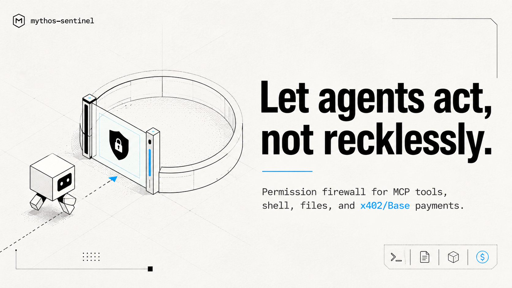

> [!NOTE]
> Mythos Sentinel is in active build-out. Full code release coming soon.

# Mythos Sentinel

**The permission firewall for autonomous AI agents, MCP tools, skills, and x402/Base payments.**

Before your agent runs it, Mythos checks it.

Mythos Sentinel is the control layer around agents: a local, keyless policy engine and dashboard that scans agent code and lets agents ask for permission before touching shell commands, files, network domains, or x402 payments.
